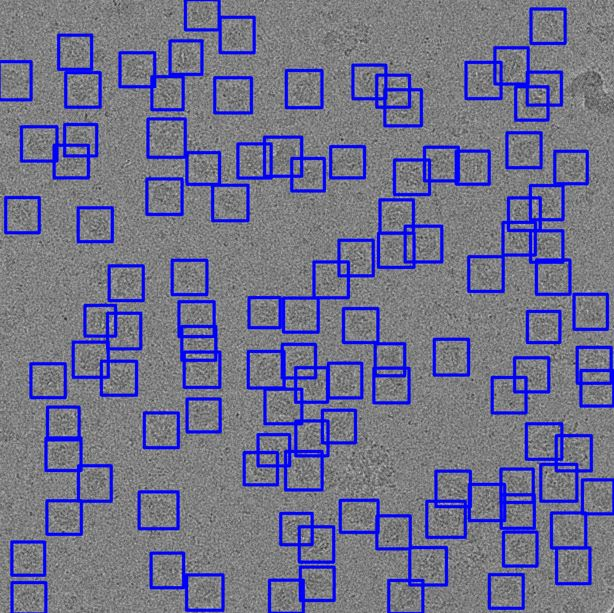
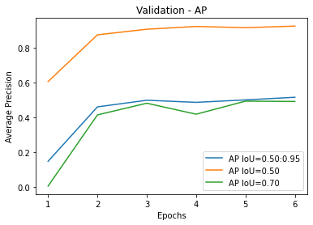
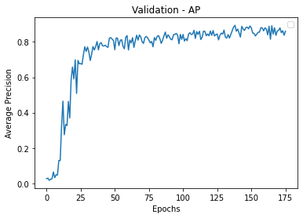

# Protein Particle Detection

Perform object detection to identify protein particles from micrographs, EfficientDet and Yolo algorithm are used to identify the particles  


## Stage 1
In this stage data preparation is done. It have following 7 steps, all the required configuration is provided through yaml file  
 - Stage 1.1: Cleaning annotation box files
 - Stage 1.2: Split data into Train/Validation/Test
 - Stage 1.3: Crop images into overlapping regions
 - Stage 1.4: Visualize annotation on training and validation images
 - Stage 1.5: Convert annotations from box to coco format
 - Stage 1.6: Convert annotations from box to Yolo format
 - Stage 1.7: Create TensorflowRecords

Run this code with following command
```
python src/stage1.py --config myconfig.yaml
```

## Stage 2
Training step, data required for both Efficientdet and Yolo is prepered in previous stage

```
# EfficientDet Training

PYTHONPATH="src/efficientdet:$PYTHONPATH" \
    python src/efficientdet/main.py \
    --mode=train_and_eval \
    --hparams=efficientdetconfig.yaml \
    --model_name=efficientdet-d0 \
    --ckpt=efficientdet-d0 \
    --train_file_pattern=TcdA1/tf_data/protein_train-*-of-00002.tfrecord \
    --val_file_pattern=TcdA1/tf_data/protein_val-*-of-00001.tfrecord \
    --model_dir=TcdA1/model_5/ \
    --train_batch_size=4 \
    --num_examples_per_epoch=750  --num_epochs=10  \
    --eval_batch_size=4 --eval_samples=190  \


# Exporting Model
# Exporting
PYTHONPATH="src/efficientdet:$PYTHONPATH" \
    python src/efficientdet/model_inspect.py \
    --runmode=saved_model \
    --hparams=efficientdetconfig.yaml \
    --model_name=efficientdet-d0 \
    --ckpt_path=TcdA1/model_4/model.ckpt-1114 \
    --saved_model_dir=TcdA1/exported_model_4-6/	
```


```
# Yolov5 Training
python src/yolov5/train.py \
    --data yoloconfig.yaml \
    --hyp src/yolov5/data/hyps/hyp.finetune.yaml \
    --project TcdA1/Yolov5/ \
    --name model1 \
    --weights yolov5s.pt \
    --imgsz 512 --batch 4 --epochs 500
```

### EfficientDet-D0 training performance


### YoloV5 training performance



## Stage 3
Model prediction and result aggregation from cropped images  
 - Stage 3.1: Model prediction
 - Stage 3.2: Post processing
 - Stage 3.3: Visualization
 
Run this code with following command
```
python src/stage3.py --config myconfig.yaml
```

